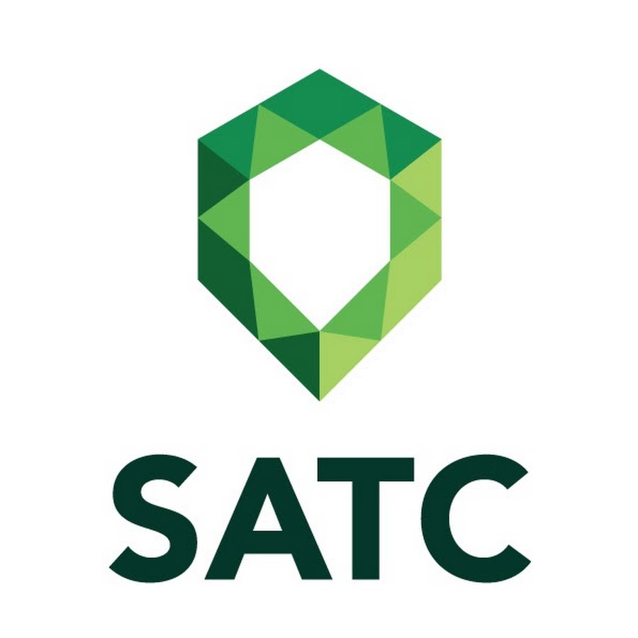

# infosatc-lp-avaliativo-02

<h1 align="center">Técnico informática </h1>

<h2 align="center">Informática</h2>

<h1 align="center">Atividade avaliativa 01 da disciplina de linguagem de programação do curso técnico de informática SATC 2021</h1>

<h1 align="center">Linguagem Pyton</h1>
 
